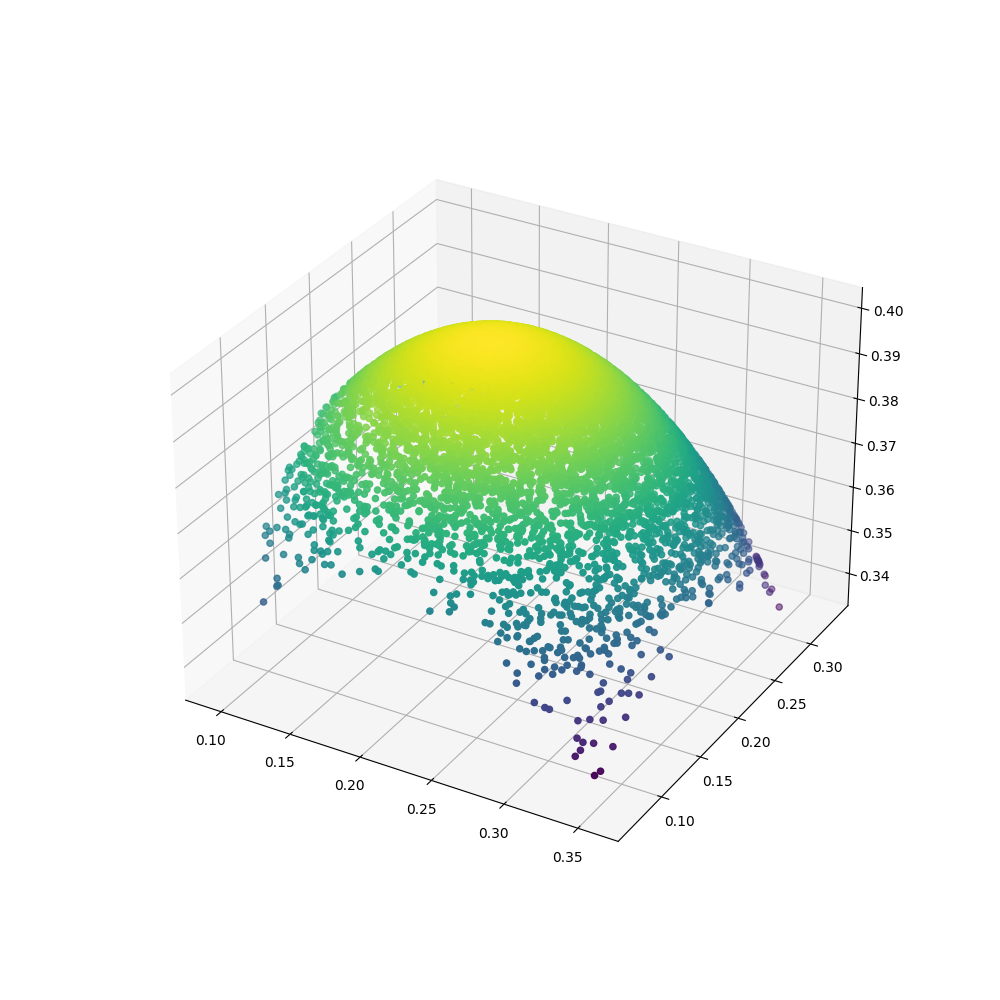

# Inverse Kinematics of Tendon Driven Continuum Robots using Invertible Neural Network

<p align="left">
    <a href="https://www.python.org/">
      </a>
    <a href= "https://www.tensorflow.org">
      </a>
    <a href= "https://scikit-learn.org/stable/">
      </a>

</p>

## Introduction

Inverse Kinematics is one of the most crucial problems in robotics, needed to map configuration space to joint space to facilitate smooth motion 
while performing any task. Owing to the kinematic redundancy and non-linearities in the continuum robots, Inverse Kinematics is relatively
challenging. Thus, we present a static model based on cosserat rod theory and string theory to represent a tendon driven continuum robot. 
We propose an invertible neural network to represent inverse kinematics. This repository contains implementation for our work "Inverse Kinematics 
of Tendon Driven Continuum Robots using Invertible Neural Network" published in <a href = "http://www.icca.net">CompAuto 2022</a>.

## Motion Planning Demo - 

The INN trained was tested by controling the robot on a circle trajectory of radius = 45 mm and height = 397 mm. The motion of the robot is shown in the below video - 

<p align="center">

</p>

## Project Layout 

To ease the implementation of different learning models and kinematic models, the project is structured in the following manner - 

```
    .
    ├── Algorithms              # All the ML and DL Models
    │   ├── INN                 # Inverible Neural Networks
    │   ├── RBF                 # Radial Basis Functions
    │   ├── MLP                 # Multi-Layer Perceptron
    │   ├── ELM                 # Extreme Learning Machine
    │   └── Cascade_Correlatin  # Cascade Correlation
    |
    ├── Dataset                 # Contain the workspace generated using different models as a pkl file
    |
    ├── Models                  # Kinematic Robot Models
    │   ├── PCC                 # Piecewise Constant Curvature Model
    │   └── Static              # Static Model based on cosserat rod theory and string theory
    |
    ├── Results                 # Result Directory
    │   ├── Training            # All the learning models are stored as sav file
    │   ├── Trajectory          # Stores the trajectory output from learning models
    │   └── Workspace           # Snipet of workspace generated using Kinematic Models
    |
    ├── main.py.                # Main program to train different learning models
    └── trajectory.py           # Test the trained model on different trajectories
    
```
## Kinematic Model

Owing to the experimental accuracy of Static Models compared to the PCC method, we represented the kinematics of the continuum robot using a model based on cosserat rod theory and string theory presented by <a href="https://ieeexplore.ieee.org/document/5957337?arnumber=5957337">D. Rucker</a>. By solving the static equations using **ode45 solver** the end effector position and orientation are calculated for different tendon tension representations. The codes are implemented in C++ and solved using **Levenberg Marquardt solver**. The rotation matrix is then converted to **quaternions**. Quaternions offer flexibility and doesn’t suffer from parameterization singularities (gimble lock). Quaternions also offer smooth interpolation of orientations along with efficient composition of rotations. Robot workspace used for training the learning model is shown in below figure -

<p align="center">

</p>

## Invertible Neural Networks (INN)

<a href="https://arxiv.org/abs/1808.04730">Invertible Neural Networks</a> make use of a latent variables $z$ to learn the forward process, and provide the full posterior over the parameter space. Latent output variables $z$ are used to prevent information loss in the forward pass, by learning information about $x$ that is not represented in $y$. Hence, the network optimizes a supervised loss for $y$ and unsupervised loss for $z$ to
associate the parameters $x$ with unique pairs of $[y, z]$ target and latent variables. The network architecture is shown in below figure - 

<p align="center">

</p>

To add invertibilty to the neural networks we make use of coupling layers which are shown in figure below. Affine coupling layers enable the flow transformation as the affine transformation is invertible and the Jacobian is easy to compute.

<p align="center">

</p>

## Training INNs

To test the INN model, 20000 random tendon tensions are taken. The output of the network is taken as the end effector position and orientation in quaternions. To improve the accuracy of the model and speed up the training process, dataset is normalized between 0 and 1. The network is trained on 97% of the dataset. The Invertible Neural Network was trained for 1000 iterations. The Inverse loss can be observed to be significantly close to the forward loss as shown - 

<p align="center">

</p>

## Benchmarking INN

To validate the efficacy and accuracy of our proposed network, 5 previous models are compared: Multi-layer Perceptron, Radial Basis Function, K Nearest Neighbors Regression, Decision Tree, Extreme Learning Machine, and so on. The below table displays the RMSE errors on both the training and testing datasets.

| Model  | Training RMSE | Testing RMSE  | Max Error |
| ------------- | ------------- | ------------- | ------------- |
| KNNR  | 1.51  | 1.87  | 7.83  |
| RBF  | 2.83  | 2.99  | 6.45  |
| MLP  | 2.65  | 2.69  | 6.25  |
| ELM  | 1.76  | 1.84  | 5.85  |
| Decision Tree  | 1.17  | 1.97  | 11  |
| **INN**  | **0.0058**  | **0.09**  | **4.13**  |

## Contact

If you have any questions, please let me know:

- Shaswat Garg {[sis_shaswat@outlook.com]()}


